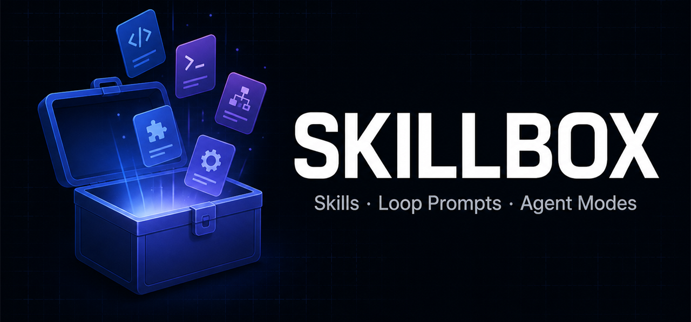

<div align="center">



# 🧰 Skillbox

**A curated box of skills, loop prompts, and agent modes for coding agents.**

[](#-browse-the-catalogue)
[](#-browse-the-catalogue)
[](#-browse-the-catalogue)
[](https://github.com/ZacheryKuykendall/skillbox/commits/main)
[](LICENSE)
[](CONTRIBUTING.md)

[](docs/compatibility.md)
[](docs/compatibility.md)
[](docs/compatibility.md)

</div>

Clone it, copy what you want, close the tab. Every asset here is a Markdown file — there is no CLI to install, no package to add, no build step, and no service to sign up for. Getting one working means putting a file where your editor already looks.

## 📖 Contents

- [🚀 Quick start](#-quick-start)
- [📦 What is in the box](#-what-is-in-the-box)
- [📂 Browse the catalogue](#-browse-the-catalogue)
  - [📐 Planning](#-planning)
  - [🔍 Code Review and Quality](#-code-review-and-quality)
  - [🧪 Testing and Debugging](#-testing-and-debugging)
  - [📝 Documentation](#-documentation)
  - [🔀 Git and Release](#-git-and-release)
- [🔌 Which tools support what](#-which-tools-support-what)
- [🤝 Contributing](#-contributing)
- [🔒 Security](#-security)
- [📚 Resources](#-resources)
- [📄 License](#-license)

## 🚀 Quick start

Grab one asset. A skill is a folder, so copy the whole thing and keep its name:

```powershell
git clone https://github.com/ZacheryKuykendall/skillbox.git
Copy-Item -Recurse .\skillbox\skills\commit-message .\.github\skills\commit-message
```

```bash
git clone https://github.com/ZacheryKuykendall/skillbox.git
cp -r skillbox/skills/commit-message .github/skills/commit-message
```

Reload your editor, type `/commit-message` in chat, and it is available.

> 💡 Prefer to install everything at once and keep it current with `git pull`? [docs/getting-started.md](docs/getting-started.md) covers pointing Copilot's settings at a clone and installing as a local Cursor plugin.

## 📦 What is in the box

Three kinds of asset, which differ in how the agent reaches for them.

| | What it is | How it activates |
| --- | --- | --- |
| 🧩 **Skill** | Reusable knowledge for a class of task | The agent loads it when it judges it relevant, or you type `/name` |
| 🔁 **Loop prompt** | A task that repeats a check until a condition is met | You run it deliberately with `/name` |
| 🎭 **Agent mode** | A persona with its own instructions and tool access | You switch into it, or delegate to it |

Skills are the portable ones — the same folder works in every supported tool. Loop prompts and agent modes are host-specific, and one has no Cursor equivalent. [docs/compatibility.md](docs/compatibility.md) has the details.

## 📂 Browse the catalogue

Grouped by what you are trying to do. The icon on each entry is its type:
🧩 skill &nbsp;·&nbsp; 🔁 loop prompt &nbsp;·&nbsp; 🎭 agent mode

### 📐 Planning

_Deciding what to build and in what order before any code exists, and keeping the plan honest once it does._

- 🎭 **[implementation-planner](agents/implementation-planner.agent.md)** — Turns a requirement into independently verifiable steps, each naming its files and carrying an acceptance check. Read-only by construction, so it cannot quietly start implementing.
- 🔁 **[plan-implement-review](prompts/plan-implement-review.prompt.md)** — Runs a change through four gated steps and stops at each gate instead of pushing through.

### 🔍 Code Review and Quality

_Catching what the author stopped being able to see._

- 🔁 **[code-review](prompts/code-review.prompt.md)** — Reviews a diff for correctness, error handling, edge cases, and security, then gives an accept or request-changes verdict. Says a change is sound rather than inventing nitpicks to look thorough.

### 🧪 Testing and Debugging

_Working out why something is broken, and fixing it without destroying the evidence._

- 🎭 **[debugger](agents/debugger.agent.md)** — Diagnoses from runtime evidence before proposing anything, and will say "I don't know yet" rather than guess.
- 🔁 **[fix-until-green](prompts/fix-until-green.prompt.md)** — Drives a failing suite to passing one hypothesis at a time, under an explicit give-up bound, and refuses to weaken a test to get there.

### 📝 Documentation

_Writing things a reader can act on._

- 🧩 **[technical-documentation](skills/technical-documentation/)** — Writes or reviews docs with separate structures for guides, references, explanations, and READMEs, and refuses to document a flag it has not verified.

### 🔀 Git and Release

_The paperwork around shipping._

- 🧩 **[commit-message](skills/commit-message/)** — Writes a commit message that explains *why* a change was made, matched to whatever convention the repository already uses.

## 🔌 Which tools support what

| Asset type | GitHub Copilot | Cursor | Claude Code |
| --- | --- | --- | --- |
| 🧩 Skills | `.github/skills/` | `.cursor/skills/` | `.claude/skills/` |
| 🔁 Loop prompts | `.github/prompts/` | as a command | no equivalent |
| 🎭 Agent modes | `.github/agents/` | as a subagent | no equivalent |

Two things worth knowing before you plan around this:

- ⚠️ **Cursor has no file-based custom modes.** They are not documented and cannot be distributed by any repository. Skillbox agent files install as Cursor *subagents* instead — same ingredients, but you delegate to them rather than switching into them.
- ⚠️ **Copilot renamed custom chat modes to custom agents.** If you have `.chatmode.md` files, they need renaming to `.agent.md`.

One rule applies everywhere and fails silently when broken: **a skill's folder name must exactly match the `name` in its frontmatter.** Cursor and Anthropic document this independently.

[docs/compatibility.md](docs/compatibility.md) covers all of it, and keeps a short list of open questions this repository has *not* settled rather than quietly presenting inferences as fact.

## 🤝 Contributing

New assets are welcome, and so are corrections. [CONTRIBUTING.md](CONTRIBUTING.md) has the process; [docs/authoring.md](docs/authoring.md) has the format contract per type and the quality bar.

> 🔬 The most valuable contribution is not a new asset. It is testing an existing one in a tool it has not been tried in and reporting what happened — see the [open questions](docs/compatibility.md#open-questions), all three of which one person could settle in about two minutes.

## 🔒 Security

> ⚠️ **These assets are curated, not audited.** Read one before you install it.

An agent asset is not passive data. It becomes instructions to a model that can read your files, edit them, and run commands. A malicious or careless one can exfiltrate secrets, destroy work, or quietly do something other than what its description claims. The relevant risks are prompt injection, instructions that widen tool access, and instructions that suppress the checks meant to catch mistakes.

Everything here is plain Markdown with no scripts, so reviewing an asset means reading one file — do that, particularly for anything that tells an agent to run commands or push to a remote. If you find something in this repository that looks wrong, please [open an issue](https://github.com/ZacheryKuykendall/skillbox/issues/new/choose).

## 📚 Resources

### 📘 Official documentation

**GitHub Copilot and VS Code**

- [Custom agents in VS Code](https://code.visualstudio.com/docs/agent-customization/custom-agents) — the `.agent.md` format and its frontmatter
- [Customize AI in VS Code](https://code.visualstudio.com/docs/copilot/customization/overview) — how skills, prompts, instructions, and agents relate
- [Copilot custom agents configuration](https://docs.github.com/en/copilot/reference/custom-agents-configuration) — the full frontmatter reference
- [VS Code Copilot Chat changelog](https://github.com/microsoft/vscode-copilot-chat/blob/main/CHANGELOG.md) — where format changes land first

**Cursor**

- [Agent Skills](https://cursor.com/docs/skills) — skill locations and frontmatter
- [Subagents](https://cursor.com/docs/subagents) — the Cursor equivalent of an agent mode
- [Plugins reference](https://cursor.com/docs/reference/plugins) — the manifest that makes this repo installable in one step
- [Rules](https://cursor.com/docs/rules) — `.mdc` rules and `AGENTS.md`

**Anthropic**

- [Agent Skills in Claude Code](https://code.claude.com/docs/en/skills) — the four scopes and the `/name` invocation model
- [The `.claude` directory](https://code.claude.com/docs/en/claude-directory) — what lives where, and what to commit
- [Skills how-to](https://claude.com/docs/skills/how-to) — authoring, bundled files, and packaging

### ✍️ Learning to write good assets

- [docs/authoring.md](docs/authoring.md) — the format contract and quality bar used here
- [Anthropic: writing effective tools for agents](https://www.anthropic.com/engineering/writing-tools-for-agents) — applies directly to skill descriptions
- [Cursor: best practices for coding with agents](https://cursor.com/blog/agent-best-practices) — first-party guidance on rules and commands

### 🌐 Other catalogues worth browsing

- [awesome-claude-skills](https://github.com/ComposioHQ/awesome-claude-skills) — large curated skill list with a strong resources section
- [awesome-llm-apps](https://github.com/Shubhamsaboo/awesome-llm-apps) — runnable agent and RAG templates
- [awesome-openclaw-skills](https://github.com/VoltAgent/awesome-openclaw-skills) — thousands of skills, organised by category
- [Anthropic skills repository](https://github.com/anthropics/skills) — official example skills

## 📄 License

MIT — see [LICENSE](LICENSE). Fork it, copy from it, ship it.
