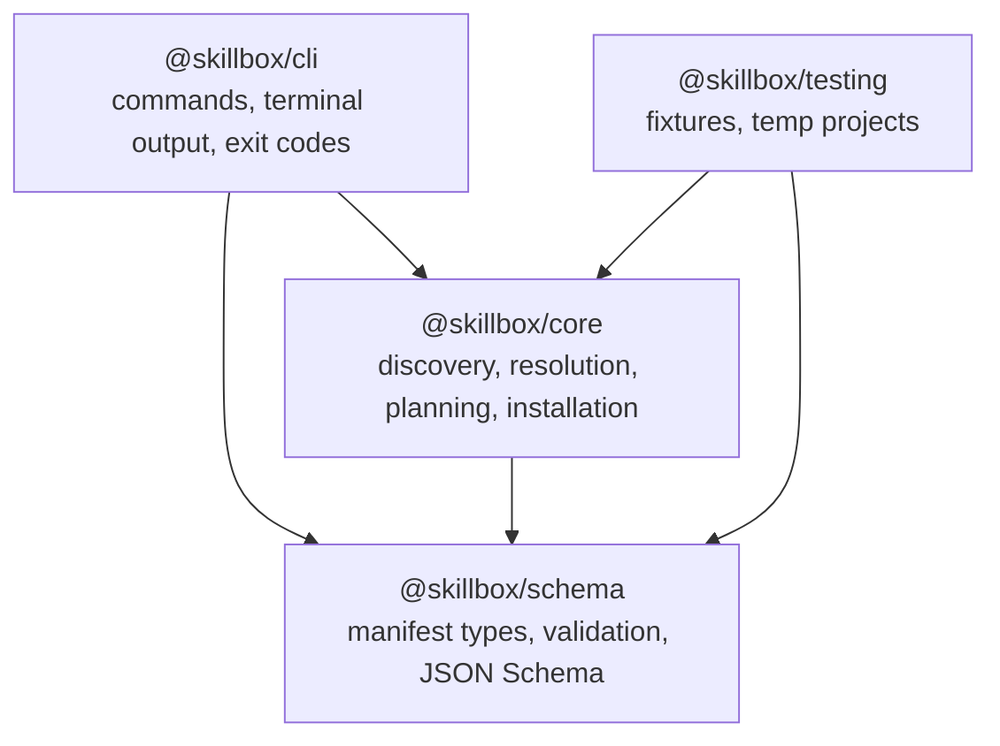
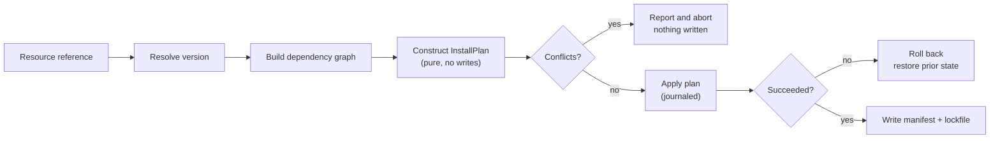
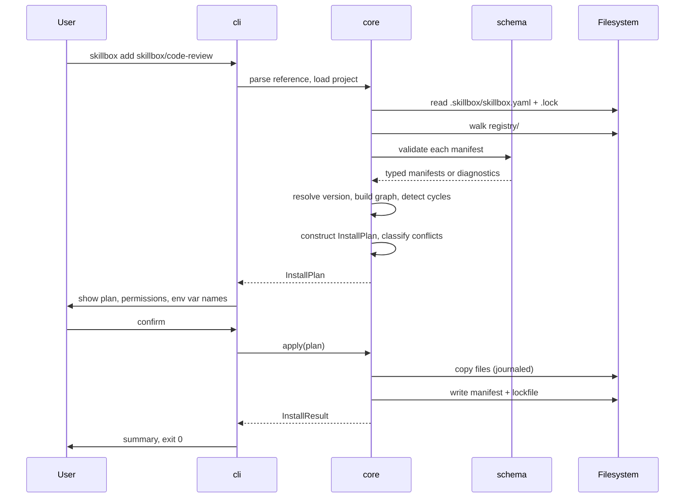

# Architecture Overview

How Skillbox v0.1.0 is put together and why.

Related: [repository-structure.md](repository-structure.md), [resource-model.md](resource-model.md), [security-model.md](security-model.md), [decisions/](decisions/README.md).

---

## 1. Shape of the system

Skillbox is a modular monorepo built around a reusable core rather than one application. Four packages with a strict, one-directional dependency graph:

`cli -> core -> schema` never reverses. `core` must not import CLI presentation logic and must not write to stdout; if it needs to communicate progress it returns data or accepts an injected reporter. This is enforced by an ESLint `no-restricted-imports` rule, not just convention (NFR-6).

The payoff is that the entire domain is usable without a terminal. A future editor extension or registry service consumes `@skillbox/core` directly, and none of the logic has to be extracted from command handlers first.

## 2. Package responsibilities

### @skillbox/schema

The vocabulary layer. Owns resource kinds, manifest types, runtime validation, JSON Schema generation, name and version rules, and the declaration types for permissions, dependencies, and environment variables.

Deliberately has **no filesystem access**. It validates values, not directories. That keeps validation fast, trivially unit-testable, and reusable in contexts with no disk — a browser-based catalog viewer, for example.

Zod is the single source of truth for both runtime validation and static types: schemas are defined once and types inferred with `z.infer`, so a validated value and its TypeScript type cannot drift apart ([ADR-0002](decisions/ADR-0002-resource-manifest-format.md)).

### @skillbox/core

The domain layer, and where nearly all logic lives.

| Concern                                          | Module               |
| ------------------------------------------------ | -------------------- |
| Containment-checked path resolution              | `paths.ts`           |
| Manifest reading from disk                       | `manifest-loader.ts` |
| Registry walking and indexing                    | `catalog.ts`         |
| Search and ranking                               | `search.ts`          |
| Semver resolution                                | `resolve.ts`         |
| Dependency graph and cycle detection             | `graph.ts`           |
| Install plan construction and conflict detection | `plan.ts`            |
| Plan application with rollback                   | `apply.ts`           |
| Project manifest IO                              | `project.ts`         |
| Lockfile serialization                           | `lockfile.ts`        |
| Integrity digests                                | `integrity.ts`       |
| Variable substitution                            | `variables.ts`       |
| Removal                                          | `remove.ts`          |
| Update planning                                  | `update.ts`          |
| Diagnostics                                      | `doctor.ts`          |

### @skillbox/cli

The presentation layer, and intentionally thin. Parses arguments with Commander, calls one core function, renders the result, and returns an exit code. A command handler that starts making decisions is a signal that logic belongs in `core`.

Terminal color comes from Node's built-in `node:util` `styleText`, so there is no color dependency ([ADR-0006](decisions/ADR-0006-build-orchestration.md)).

### @skillbox/testing

Private. Provides temporary-project helpers and manifest fixtures — valid ones per kind and invalid ones per documented failure mode — so the same fixtures back the schema, core, and CLI suites instead of being re-declared three times.

## 3. The central design decision: plan, then apply

Every mutating operation splits into two phases.

**Planning is pure.** It reads the catalog and the project state and returns an immutable `InstallPlan` enumerating every file operation. It writes nothing (FR-6.2).

**Applying is journaled.** It records what it created and what it overwrote, so a failure at any point can restore the prior state (FR-8.3).

Three things fall out of this split for free rather than needing separate machinery:

- `--dry-run` is just planning without applying — genuinely identical to the real code path, not a parallel implementation that can drift.
- Conflict detection and permission display happen before any mutation, which is what makes the security guarantee in SR-1 and SR-6 achievable.
- Planning logic is unit-testable with plain objects; only application needs a temporary directory.

The manifest and lockfile are written **last**, after all file operations succeed. A crash therefore cannot leave configuration claiming an install that did not finish.

## 4. Data flow: `skillbox add`

Note where validation sits: every manifest is validated **during catalog load**, before resolution. Nothing downstream handles an unvalidated manifest, which is why `core` can treat manifests as trustworthy shapes while still treating their _content_ as untrusted.

## 5. Intent versus fact

Project state is split across two files with different jobs.

|          | Project manifest               | Lockfile                                        |
| -------- | ------------------------------ | ----------------------------------------------- |
| Path     | `.skillbox/skillbox.yaml`      | `.skillbox/skillbox.lock`                       |
| Records  | What was requested             | What was resolved and installed                 |
| Versions | Ranges, e.g. `^0.1.0`          | Exact, e.g. `0.1.0`                             |
| Author   | Human-editable                 | Machine-generated                               |
| Contains | References, targets, variables | Integrity digests, file lists, dependency edges |

The manifest states intent; the lockfile states fact. The lockfile is byte-deterministic — sorted keys, no timestamps, no absolute paths — because a lockfile that produces spurious diffs stops being reviewed ([ADR-0004](decisions/ADR-0004-lockfile-design.md)).

## 6. Local-first registry

The only registry in v0.1.0 is the `registry/` directory in this repository ([ADR-0003](decisions/ADR-0003-local-registry-first.md)).

Catalog access sits behind a narrow interface — load, search, resolve — so a remote registry becomes a second implementation rather than a rewrite. Building the local case first means the resource model gets validated against seven real examples before any network protocol is committed to.

## 7. Error handling

Every failure is a typed `SkillboxError` carrying a stable machine-readable `code`, a human message, an optional location, and a remediation hint. `core` throws them; `cli` renders them and maps the code to an exit status. No error path prints a secret value (SR-8).

Exit codes are documented in the [CLI reference](../guides/cli-reference.md).

## 8. Cross-platform behavior

Manifests always use POSIX-style relative paths; `core` translates to the host separator at install time (NFR-2). Containment is verified with `path.relative` rather than string prefix comparison, because prefix checks miss `..` segments and case-folding differences on Windows (SR-13). Git is configured with `core.autocrlf false` so integrity digests are stable across platforms.

## 9. Technology choices

Full rationale is in the [ADR index](decisions/README.md).

| Area            | Choice                                 | ADR                                                                                                    |
| --------------- | -------------------------------------- | ------------------------------------------------------------------------------------------------------ |
| Language        | TypeScript 5.9.3, strict, ESM          | [0001](decisions/ADR-0001-monorepo-structure.md), [0007](decisions/ADR-0007-typescript-version-pin.md) |
| Workspace       | pnpm workspaces                        | [0001](decisions/ADR-0001-monorepo-structure.md)                                                       |
| Validation      | Zod 4 with native JSON Schema output   | [0002](decisions/ADR-0002-resource-manifest-format.md)                                                 |
| Manifest format | YAML                                   | [0002](decisions/ADR-0002-resource-manifest-format.md)                                                 |
| Registry        | Local directory                        | [0003](decisions/ADR-0003-local-registry-first.md)                                                     |
| Lockfile        | Deterministic YAML, no timestamps      | [0004](decisions/ADR-0004-lockfile-design.md)                                                          |
| Security        | Deny-by-default, no execution          | [0005](decisions/ADR-0005-security-model.md)                                                           |
| Build           | `tsc -b` project references, `pnpm -r` | [0006](decisions/ADR-0006-build-orchestration.md)                                                      |
| Tests           | Vitest with a 90% coverage gate        | [0006](decisions/ADR-0006-build-orchestration.md)                                                      |

Notably absent: no bundler, no build orchestrator beyond pnpm, no color library, no JSON Schema converter. Each was evaluated and found unnecessary for four small packages (NFR-7).

## 10. Known constraints

- **No remote registry.** Catalog access is local. Tracked as SBX-102.
- **No execution.** Skillbox never runs resource code. Permissions are declarative until a sandbox exists (SBX-119).
- **`v1alpha1` is unstable.** The manifest format may change before v1.
- **Permissions are not enforced**, only declared and displayed. This is stated wherever permissions appear so the guarantee is not overread.
