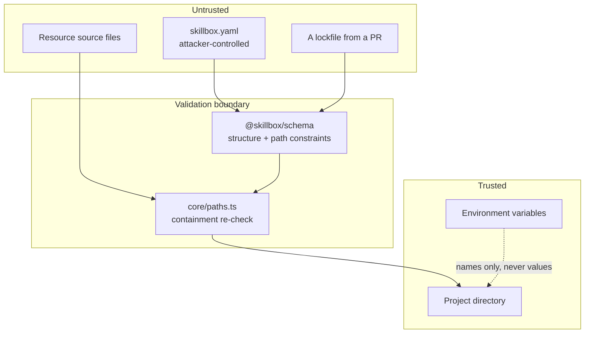

# Security Model

The threat model for Skillbox v0.1.0, the guarantees it makes, and the tests that enforce them.

Decision record: [ADR-0005](decisions/ADR-0005-security-model.md). Reporting process: [SECURITY.md](../../SECURITY.md).

---

## 1. Core assumption

**Every resource is untrusted input.**

A resource is authored by someone else, may be reviewed by no one, and its manifest is data that directly influences filesystem operations. Treating it as a trusted configuration file would be a category error — it is closer to a request body from the internet than to a project's own build config.

Everything below follows from that assumption.

## 2. Trust boundaries



| Boundary            | Untrusted side                | Trusted side               | Control                                       |
| ------------------- | ----------------------------- | -------------------------- | --------------------------------------------- |
| Manifest ingestion  | `skillbox.yaml` content       | Typed manifest object      | Schema validation, unknown-key rejection      |
| Path handling       | Any manifest path field       | A resolved filesystem path | Schema constraints, then containment re-check |
| Install destination | Declared or overridden target | The project directory      | Relativity-based containment                  |
| Resource content    | Source files                  | Project files              | Copied verbatim, never executed               |
| Environment         | Declared variable names       | Actual secret values       | Names recorded, values never read             |

Two layers guard paths on purpose. The schema rejects malformed paths as data; `core/paths.ts` re-verifies containment against the concrete project root at install time. The schema cannot do the second check because it has no filesystem access, and skipping either one would leave a gap.

## 3. Guarantees

Numbered security requirements are in [requirements.md](../product/requirements.md#security-requirements).

### G1. Nothing is written outside the project directory

Every write resolves through a containment check. A destination is permitted only if `path.relative(root, resolved)` is non-empty, does not begin with `..`, and is not absolute.

String prefix comparison is **not** used. `startsWith` accepts `/project-evil` for a root of `/project`, and on Windows it fails on case differences (`C:\Project` vs `c:\project`) and on 8.3 short names. Relativity handles all of these because it normalizes first.

Rejected before any write occurs:

| Vector             | Example                                       |
| ------------------ | --------------------------------------------- |
| Traversal          | `../../etc/passwd`                            |
| Traversal mid-path | `a/../../../etc/passwd`                       |
| POSIX absolute     | `/etc/passwd`                                 |
| Windows absolute   | `C:\Windows\System32\drivers\etc\hosts`       |
| Drive-relative     | `C:evil.txt`                                  |
| UNC                | `\\server\share\evil.txt`                     |
| Leading separator  | `/evil.txt`, `\evil.txt`                      |
| NUL injection      | `safe.txt\u0000../../evil`                    |
| Symlink escape     | A target directory symlinked outside the root |

Symlinks get their own treatment: a destination's real path is resolved with `fs.realpath` on its existing ancestor before writing, so an attacker cannot pre-create a symlink at the destination and have Skillbox follow it out of the project.

### G2. No resource code is executed

Installation copies files. It does not execute anything.

There are no lifecycle hooks. `postinstall` does not exist and is not planned — this is the single most common supply-chain attack vector in package ecosystems, and the safest design is to have no such mechanism at all rather than a guarded one.

For a `script` resource, **installing and running are separate actions**. Skillbox installs the file; you run it yourself, deliberately. The manifest's `interpreter` field describes how you would run it; Skillbox never acts on it.

`validate`, `inspect`, `search`, `list`, and `doctor` are all read-only and equally never execute resource code.

### G3. Secret values never enter Skillbox

Manifests declare environment variables **by name**:

```yaml
env:
  - name: SKILLBOX_EXAMPLE_API_TOKEN
    description: Bearer token for the target service.
    required: true
    secret: true
```

There is no field for a value, and the schema's unknown-key rejection means one cannot be smuggled in.

Skillbox therefore:

- Never reads `process.env` for a declared variable's value. `doctor` checks only presence, via a `name in process.env` test.
- Never writes a value into the project manifest, the lockfile, or any output.
- Never substitutes environment values into installed files. Variable substitution uses **project variables** only, which are declared configuration, never secrets.
- Never echoes an input value in a validation error for an `env` field, since that input could itself be a pasted secret.

Enforced by a test that sets a sentinel value in the environment, runs the full lifecycle, and asserts the sentinel appears in no captured stream and no written artifact.

### G4. Effects are visible before they happen

Planning is separate from application, so the user sees the complete plan — resources, versions, destination paths, declared permissions, and required environment variable names — before anything is written.

`--dry-run` uses the identical planning code path and stops before applying, so it cannot drift from real behavior.

### G5. Installs are atomic

Application is journaled. Every created file and every overwritten file's prior content is recorded, so a failure at any point restores the prior state. The project manifest and lockfile are written **last**, so a crash cannot leave configuration claiming an install that did not complete.

### G6. Integrity is recorded and verifiable

Every installed file's SHA-256 digest is recorded in the lockfile as `sha256-<base64>`. This makes three otherwise-invisible situations detectable:

- A local edit to an installed file, so removal does not silently discard your work.
- Corruption or truncation.
- A file replaced by something other than Skillbox.

`doctor` verifies digests; `remove` refuses to delete a modified file unless forced.

## 4. Threats

### T1. Path traversal through a manifest — mitigated

A malicious `install.target` or `files` entry attempts to write outside the project. Blocked by schema path constraints plus the containment re-check (G1). Tested per-vector in `packages/core/test/security-paths.test.ts`.

### T2. Arbitrary code execution on install — mitigated by design

There is no execution mechanism to exploit (G2). This is a design property, not a control that could be misconfigured.

### T3. Secret exfiltration — mitigated

A resource declares a variable hoping Skillbox will read and record it. Skillbox never reads values (G3).

Residual risk: once you install a `script` or `api` resource and run it _yourself_, that code runs with your environment. Skillbox surfaces `env:read`, `secrets:read`, and `network:outbound` declarations before install so the risk is visible, but running installed code is your decision. Sandboxing is SBX-119.

### T4. Silent overwrite of your files — mitigated

An install target aimed at `src/index.ts` would clobber real work. Conflicts are detected during planning, classified, and reported before mutation; overwriting requires an explicit force flag (FR-8.4).

### T5. Malicious or malformed lockfile — mitigated

A lockfile arrives via a pull request with tampered paths or digests. Lockfiles are schema-validated on read and every path from a lockfile passes the same containment check as a manifest path. A tampered digest causes a `doctor` mismatch rather than a silent accept.

Residual risk: a lockfile with a _correct_ digest for malicious content is indistinguishable by digest alone. Signing is SBX-111. Review lockfile diffs in PRs.

### T6. Dependency confusion — partially mitigated

The catalog is local and namespaced, so there is no remote resolution to shadow. Duplicate `namespace/name@version` entries are an error (FR-2.3). This threat becomes real when a remote registry exists; namespace ownership is a prerequisite for SBX-102.

### T7. Zip-slip and symlink escape — mitigated

No archive extraction exists in v0.1.0. Symlink escape is blocked by real-path resolution before writing (G1).

### T8. Denial of service through a hostile manifest — partially mitigated

Bounded string lengths, a maximum tag count, and cycle detection prevent the obvious cases. A pathologically large local catalog is out of scope: you supply your own catalog in v0.1.0.

### T9. Typosquatting — accepted for now

Nothing stops a resource named `code-reviw`. With a local, reviewed catalog the risk is minimal. Namespace verification and reputation are SBX-104 and SBX-112.

## 5. Permissions: declarative, not enforced

Permissions use a closed vocabulary (`filesystem:read`, `filesystem:write`, `network:outbound`, `process:spawn`, `env:read`, `secrets:read`, `model:invoke`) validated at the schema layer.

**They are not enforced in v0.1.0.** Skillbox has no runtime, so there is nothing to enforce them in. They are validated and displayed so that a user can make an informed decision, and so that resources authored today carry the metadata a future sandbox will need.

This is stated plainly everywhere permissions appear. A declared permission is a claim by the author, not a constraint imposed by Skillbox. Enforcement is SBX-119.

## 6. Required tests

Security controls are only real if tested. These suites are mandatory and may not be weakened without an ADR.

| Suite                                  | Covers                                                                                                                    |
| -------------------------------------- | ------------------------------------------------------------------------------------------------------------------------- |
| `core/test/security-paths.test.ts`     | Every T1 vector individually; symlink escape; containment on both platforms                                               |
| `core/test/security-manifests.test.ts` | Malformed YAML, invalid manifests, undeclared entrypoints, undeclared files, conflicts, missing and circular dependencies |
| `core/test/security-secrets.test.ts`   | Sentinel environment value absent from all output and artifacts                                                           |
| `core/src/apply.test.ts`               | Rollback leaves no partial state under injected failure                                                                   |
| `core/src/integrity.test.ts`           | Digest stability and change detection                                                                                     |
| `schema/src/spec.test.ts`              | Path constraint rejection at the schema layer                                                                             |

Each vector is asserted individually rather than in a loop, so a failure names the specific vector that regressed.

## 7. Reviewing an untrusted resource

Before installing something you did not write:

1. `skillbox inspect <resource>` — read the declared permissions, environment variables, and install targets.
2. Check where it installs. A target inside `src/` will place files among your source.
3. Read the entrypoint. It is plain text; the whole point of not executing anything is that reading is safe.
4. For `script` and `api` resources, remember that installing is safe but running is your call.
5. `skillbox add <resource> --dry-run` to see exact file operations first.

## 8. Non-goals for v0.1.0

Deliberately absent, each tracked on the [roadmap](../roadmap.md):

- Sandboxed execution and runtime permission enforcement (SBX-119).
- Package signing and signature verification (SBX-111).
- Author identity and namespace ownership (SBX-104).
- Reputation and verification (SBX-112).
- Policy enforcement and approval workflows (SBX-113, SBX-114).
- Automated dependency vulnerability scanning of resources.

Their absence is why the MVP takes the conservative position of never executing anything: without identity, signing, or sandboxing, non-execution is the only defensible default.
