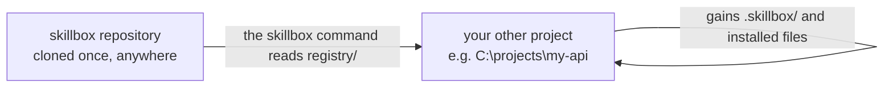

# Using Skillbox in Another Project

How to install Skillbox resources into a project that is not this repository.

## The shape of it

One thing to get clear first, because it is the most common wrong assumption:

**You do not copy this repository into your other project.** Skillbox is a tool you run _from inside_ another project, like `git` or `eslint`. It stays where it is; it reaches into your project and writes resource files there.



Your project ends up with a `.skillbox/` directory holding its configuration, lockfile, and the resources it installed. Nothing of Skillbox's own source goes there.

## Prerequisites

Clone and build this repository once. Anywhere is fine; the examples use `C:\projects\skillbox`.

```powershell
git clone https://github.com/ZacheryKuykendall/skillbox.git C:\projects\skillbox
cd C:\projects\skillbox
pnpm install
pnpm build
```

```bash
git clone https://github.com/ZacheryKuykendall/skillbox.git ~/skillbox
cd ~/skillbox
pnpm install
pnpm build
```

`pnpm build` matters: the launcher at `packages/cli/bin/skillbox.js` loads compiled output from `dist/`, so an unbuilt clone fails with a module-resolution error.

## Getting a `skillbox` command

Pick one. The first needs no setup; the others give you a real command.

### Option 1: call the launcher directly

Works immediately, from any directory, with nothing to configure.

```powershell
node C:\projects\skillbox\packages\cli\bin\skillbox.js --version
```

```bash
node ~/skillbox/packages/cli/bin/skillbox.js --version
```

Verbose, but useful in a script where being explicit is a virtue.

### Option 2: a shell function (recommended)

Add to your PowerShell profile, at `$PROFILE`:

```powershell
function skillbox { node C:\projects\skillbox\packages\cli\bin\skillbox.js @args }
```

Or to `~/.bashrc` or `~/.zshrc`:

```bash
skillbox() { node ~/skillbox/packages/cli/bin/skillbox.js "$@"; }
```

Reload the shell and `skillbox` works everywhere. This is the least invasive way to get a real command: one line, easy to find, easy to remove.

### Option 3: link it globally

```powershell
pnpm setup      # one time, creates a global bin directory and adds it to PATH
cd C:\projects\skillbox\packages\cli
pnpm link --global
```

Gives a genuine `skillbox` binary. Note that `pnpm setup` edits your PATH and shell profile, so Option 2 is usually the better trade.

### What will not work

```powershell
pnpm add -D file:C:\projects\skillbox\packages\cli   # fails
```

```text
ERR_PNPM_WORKSPACE_PKG_NOT_FOUND  "@skillbox/core@workspace:*" is in the
dependencies but no package named "@skillbox/core" is present in the workspace
```

`@skillbox/cli` depends on its siblings through pnpm's `workspace:` protocol, which only resolves inside this monorepo. Installing the CLI as a dependency of another project therefore cannot work yet. Publishing it properly is tracked as SBX-110 on the [roadmap](../roadmap.md); until then, run it from the clone.

## Using it

From your other project's root:

```powershell
cd C:\projects\my-api
skillbox init
```

```text
Initialized Skillbox project.

  Created .skillbox/skillbox.yaml
  Created .skillbox/skillbox.lock
```

The registry is found automatically — the CLI resolves it relative to its own location, so no configuration is needed unless you keep a catalog elsewhere.

Then the normal loop:

```powershell
skillbox search review
skillbox inspect skillbox/code-review
skillbox add skillbox/code-review --dry-run
skillbox add skillbox/code-review
skillbox list
skillbox doctor
```

Always `inspect` before installing something you did not write. It shows the install target, the declared permissions, and any environment variables the resource needs. See the [security model](../architecture/security-model.md).

### Pointing at a different catalog

```powershell
$env:SKILLBOX_REGISTRY = "C:\projects\skillbox\registry"
```

```bash
export SKILLBOX_REGISTRY="$HOME/skillbox/registry"
```

Or per command with `--registry <path>`. Only necessary if you maintain your own catalog.

## What lands in your project

```text
my-api/
├── .skillbox/
│   ├── skillbox.yaml      what you requested; hand-editable
│   ├── skillbox.lock      what was resolved and installed, with digests
│   └── prompts/code-review/
│       ├── prompt.md
│       └── README.md
└── src/                   only if you install a component or api resource
```

**Commit `.skillbox/`.** Both files belong in version control for the same reason `package-lock.json` does: the lockfile records exact versions and integrity digests, so a teammate cloning your project gets provably identical resources. The [starter project](../../examples/starter-project) commits its own as a demonstration.

Where files land depends on the kind. Prompts, skills, agents, scripts, and workflows go under `.skillbox/`, because they are Skillbox-managed metadata. `component` and `api` resources go into `src/`, because they are application source you compile and own.

## Actually using an installed resource

Installing puts files in place. What you do next depends on the kind, and Skillbox is deliberately not involved in any of it.

### Prompts, skills, agents, and workflows

These are Markdown instructions. In an AI-assisted editor, reference the file:

```text
Follow .skillbox/prompts/code-review/prompt.md and review my staged changes.
Report only medium and high severity findings.
```

```text
Act as .skillbox/agents/implementation-planner/agent.md.

requirement: add rate limiting to the public API
```

There are no hotkeys and no runtime. A resource is a file you point something at.

If you use Cursor and want a resource applied automatically rather than referenced by hand, that is what `.cursor/rules/` is for — you can write a short rule that points at the installed file. Skillbox does not generate those rules for you.

### Scripts

**Skillbox never runs a script.** Installing and running are separate actions, by design. Run it yourself:

```powershell
node .skillbox/scripts/project-summary/summarize.mjs --depth 2
```

A convenient habit is to wrap it in your project's own `package.json`, which documents the invocation for the next person:

```json
{
  "scripts": {
    "summary": "node .skillbox/scripts/project-summary/summarize.mjs --depth 2"
  }
}
```

### Components and APIs

Ordinary source. Import it:

```typescript
import { createLogger } from './components/structured-logger/logger.js';

const logger = createLogger({ base: { service: 'my-api' } });
```

`api` resources usually need environment variables. `skillbox inspect` lists them by name; supply the values through your shell or a secret manager. Skillbox records the names only and never reads a value.

## Keeping resources current

```powershell
cd C:\projects\skillbox
git pull
pnpm install
pnpm build

cd C:\projects\my-api
skillbox update --dry-run
skillbox update
```

`update` respects the version range in your project manifest and will not cross it, so a major version bump stays a deliberate act. `doctor` reports drift at any time, including files you have edited since installing.

Editing an installed file is expected and safe. Skillbox records a digest of everything it writes, so `doctor` reports your edit as a modification and `remove` refuses to delete it without `--force`.

## Using it in several projects

Nothing to repeat. One clone of this repository serves any number of projects; run `skillbox init` in each. Each project keeps its own `.skillbox/` with its own manifest and lockfile, and they are independent.

## Troubleshooting

| Symptom                                     | Cause                                                                                                        |
| ------------------------------------------- | ------------------------------------------------------------------------------------------------------------ |
| `Cannot find module '../dist/run.js'`       | The clone was not built. Run `pnpm build` in the Skillbox repository.                                        |
| `Project is not initialized`                | No `.skillbox/` here or in a parent. Run `skillbox init`.                                                    |
| `The registry directory ... does not exist` | `SKILLBOX_REGISTRY` points somewhere wrong. Unset it to fall back to the bundled catalog.                    |
| `ERR_PNPM_WORKSPACE_PKG_NOT_FOUND`          | You tried to install the CLI as a dependency. See [what will not work](#what-will-not-work).                 |
| `Destination conflict`                      | A file already exists where a resource wants to write. Move it, override with `--target`, or pass `--force`. |

## Next

- [CLI reference](cli-reference.md) — every command, option, and exit code.
- [Creating a resource](creating-a-resource.md) — package something of your own.
- [Security model](../architecture/security-model.md) — read before installing resources you did not write.
